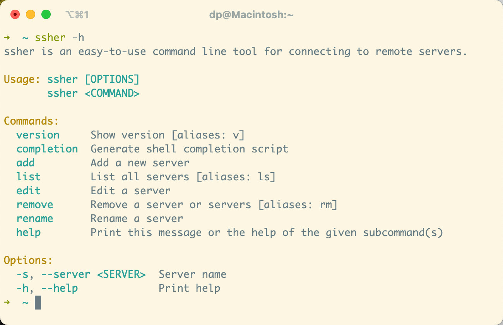

# ssher

简体中文 | [English](README.md)

ssher 是一款连接远程服务器命令行工具，简单易用。


## 安装

- 通过 `cargo install` 安装

```bash
cargo install ssher
```

- 通过二进制文件安装

对于 MacOS 或 Linux：

```bash
curl -sSL https://github.com/poneding/ssher-rs/raw/master/install.sh | sh
```

对于 Windows：

从 [Releases](https://github.com/poneding/ssher-rs/releases/latest) 下载最新版本，解压得到可执行文件并将其添加到 PATH。

## 使用



1. 选择服务器并连接

```bash
ssher
ssher -s <server>
```

2. 添加服务器

```bash
ssher add
```

3. 删除服务器

```bash
# remove, rm
ssher rm
ssher rm <server_a> <server_b>
```

4. 查看服务器

```bash
# list, ls
ssher ls
```

5. 重命名

```bash
ssher rename
ssher rename <server>
```

6. 编辑服务器

```bash
ssher edit
ssher edit <server>
```

7. 查看版本

```bash
# version, v
ssher v
```

8. 查看帮助

```bash
ssher help
```

## 命令补全

```bash
# bash
source <(ssher completion bash)
source <(COMPLETE=bash ssher)

# zsh
source <(ssher completion zsh)
source <(COMPLETE=bash zsh)

# fish
ssher completion fish | source
source (COMPLETE=fish ssher | psub)

# powershell
ssher completion powershell > ssher.ps1
. .\ssher.ps1
$env:COMPLETE = "powershell"
ssher | Out-String | Invoke-Expression
```

> 你也可以将上面的命令添加到你的 `~/.bashrc` 或 `~/.zshrc` 中，这样每次打开终端就会自动加载补全。

## 配置

配置文件保存在 `~/.ssher.yaml` 文件中。

## 故障排除

1. MacOS 默认的 bash 版本过低，当使用补全功能 `source <(COMPLETE=bash ssher)` 时，可能会出现以下错误：

```bash
$ source <(COMPLETE=bash ssher)
error: Broken pipe (os error 32)
```

解决方案:

- 使用如下命令升级 bash：

```bash
brew install bash
```

- 先生成补全文件，然后再加载：

```bash
COMPLETE=bash ssher > .ssher_bash_completion.sh
source .ssher_bash_completion.sh
```
